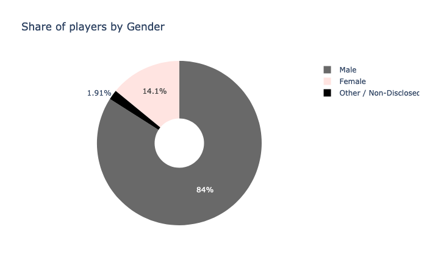
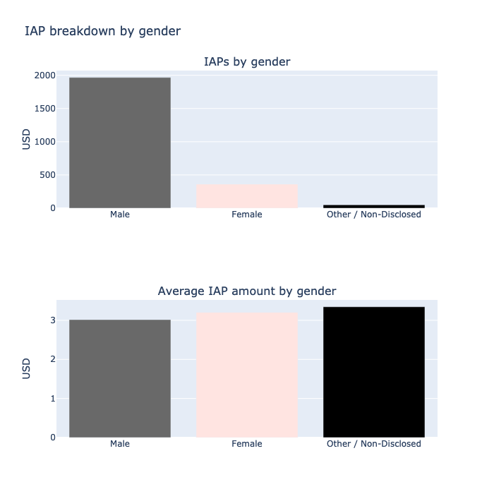
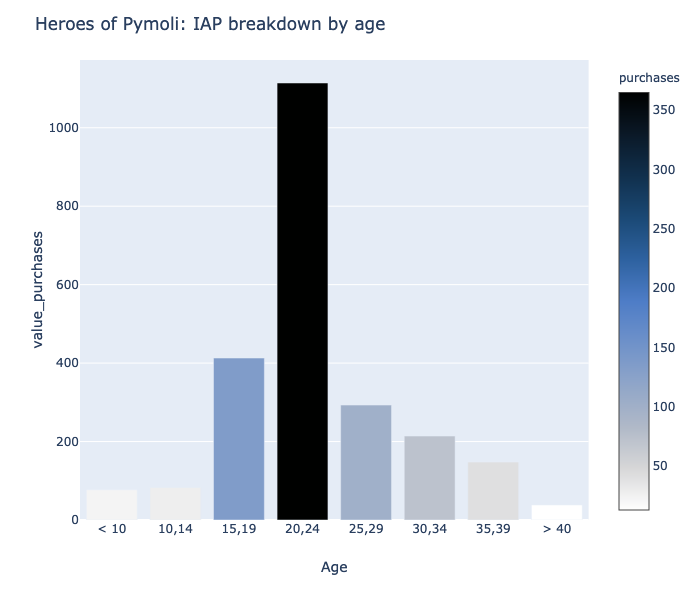
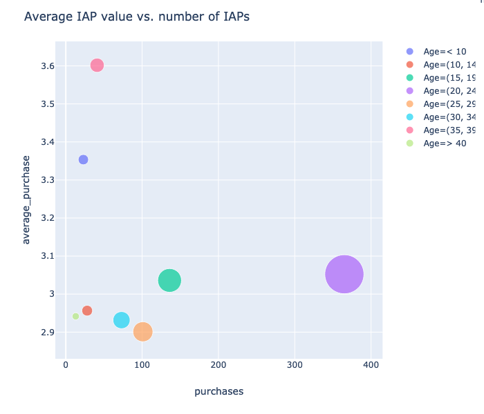
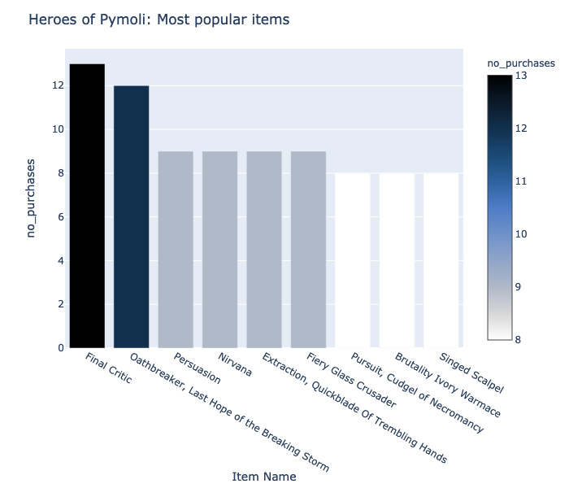
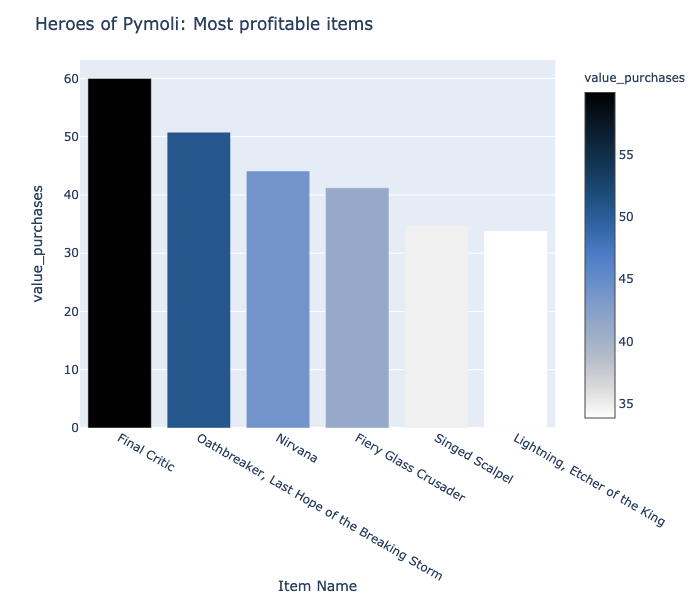

# Heroes of Pymoli: Game Analytics

In this project we will analyze data for the fictional F2P game "Heroes of Pymoli". As many other games developed on the schema free-to-play, playes are encouraged to purchase optional items that enchance their player experience.

# Key Insights

1. Heroes of Pymoli have **576** paying players in this cohort from which 4 from 5 players are male. Eventhough the **male players** are responsible for most of the IAPs, the **amount spent by female players** or diverse gender is higher in average. 

2. Most of the paying players are between 20-24 years old. While most of the IAPs revenue come from this age group, people whom are between 35 -39 years old spend more money in each transaction. Possibly the reason behind this is the more stable situation reached normally at this age. Beware!  There are some paying users with age under 10 years old making more expensive transactions than the most popular age group. Maybe we should revise the security in app-store or google-store. Also, is our game suitable for users under 10 years old?

3. In this cohort we had **780 transactions and 2379.77 USD in revenue**. We have **179 different items sold** in this cohort. The most popular and most profitable IAP item was **Final Critic** with 13 purchases and $60 in purchases.

Our top spender made 5 IAPs in this timeframe and 1 from 4 paying players makes more than 1 purchase. This number is great, reflecting the engagement our paying users have.
